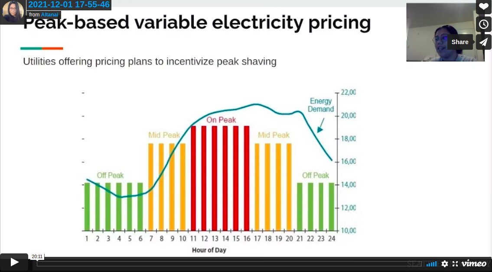

# Renewable Energy Reserach in Seattle University for Green Grid

Save copy of  **Google Collab notebooks**

Data Sets for Grids

1. EIA 

2. CA ISO - http://www.caiso.com/todaysoutlook/pages/supply.aspx (Supply trend
Energy in megawatts broken down by resource in 5-minute increments.)

3. ERCOT - http://www.ercot.com/gridinfo/generation 

5. ISO NE - Real-Time Maps and Charts 

Data Sets for LCOE / Price

1. LCOE estimates from Projected Costs of Generating Electricity 2020
 https://www.iea.org/articles/levelised-cost-of-electricity-calculator 
Assumptions 
Discount rate 7% Central case
Carbon price 30.00 USD/ton Default assumption
Heat price 37.06 USD/MWh Default assumption
Coal price 100% Default assumption
Gas price 100% Default assumption

Kaggle Notebook - https://www.kaggle.com/altanai/lcoe-levelized-cost-of-electricity-generation 

